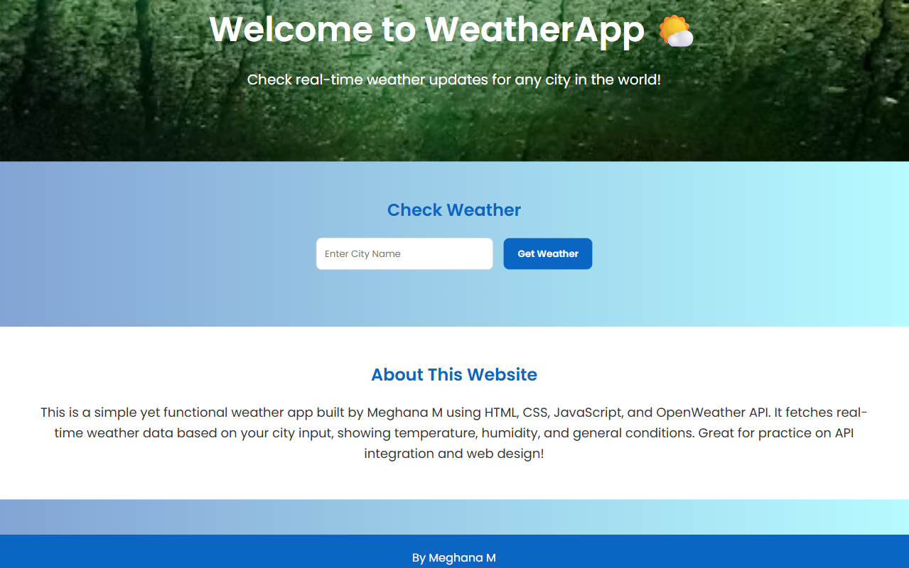
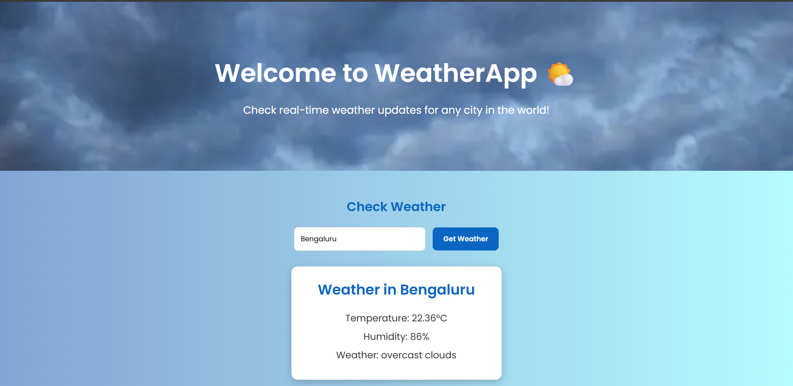

# 🌤️ Weather App

A simple and responsive weather application built using **HTML**, **CSS**, and **JavaScript** with real-time data fetched from the **OpenWeatherMap API**.

---

## Features
- Get real-time weather updates for any city in the world.
- Displays Temperature, Humidity, and Weather Conditions.
- Clean and modern UI design.
- Fully responsive — works on desktop and mobile.
- Dynamic background images (optional).

---

## Screenshots




## 🖥️ Demo

✅ **Live Website**: [https://live-weather2.netlify.app](https://live-weather2.netlify.app)

✅ **GitHub Repository**: [https://github.com/Meghasm10304/weather-app](https://github.com/Meghasm10304/weather-app)

---

## Project Structure
    weather-app/
    │
    ├── index.html # Main website page
    ├── style.css # Styling
    ├── script.js # API calls and dynamic features
    └── README.md # Project documentation


---

## Technologies Used
- HTML5
- CSS3
- JavaScript (Vanilla)
- OpenWeatherMap API

---

## How to Run Locally
1. Clone the repository:
   ```bash
   git clone https://github.com/Meghasm10304/weather-app.

2. Open index.html in your browser.


📌 Notes
The API key is hidden locally and replaced with 'YOUR_API_KEY_HERE'.

You can generate your own free API key at https://openweathermap.org/api.


⭐ Give a Star
If you like this project, consider giving it a ⭐ star on GitHub!
